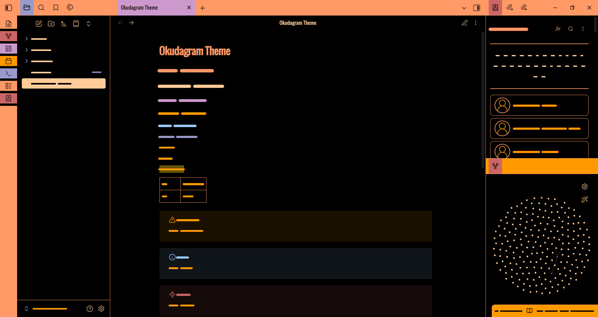
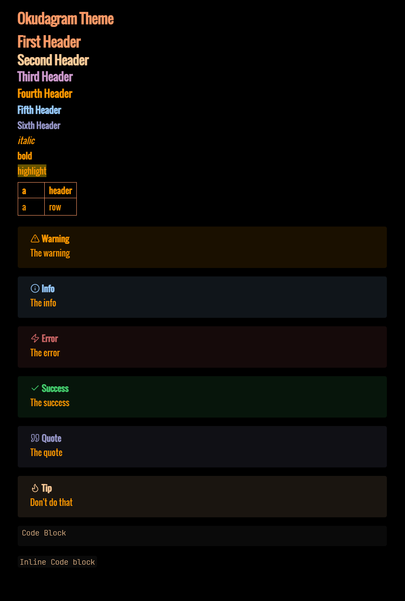

  

  
	

  
  

		

# Okudagram

An [Obsidian](https://obsidian.md) theme inspired by the computer display graphics of *Star Trek: The Next Generation*. The term "Okudagram" was coined by set decorator John M. Dwyer to describe the colorful displays designed by scenic-art supervisor Michael Okuda and the name has since been adopted by Star Trek fans and graphic design enthusiasts alike.

> [!important]
> **Dark mode only.** This theme is built and tested exclusively for Obsidian's dark color scheme. Light mode is not supported and will not render any part of the theme.
>
> **Desktop only.** This theme has not been built or tested for Obsidian on mobile and is not expected to work there.

## Features

- **Palette** — late-TNG era: peach, beige, lavender, red, amber, blue, and muted lavender on near-black.
- **Fonts** — uses fonts already shipped on most systems with no remote download required: Oswald → Bahnschrift → Helvetica Neue Condensed → Arial Narrow → system sans. Code blocks fall back through JetBrains Mono → Fira Code → Consolas → monospace. UI chrome and headings are uppercase with wide tracking.

## Install

### Obsidian Community Themes

Open **Settings → Appearance → Manage**, search for **Okudagram**, and select **Install and use**.

### Manually

1. Create a folder named `Okudagram` inside `<your-vault>/.obsidian/themes/`.
2. Copy `manifest.json` and `theme.css` from this repo into that folder.
3. In *Settings → Appearance → Themes*, pick **Okudagram**.

## Markdown Examples

## Customization

You can edit `theme.css` directly in your theme folder to tweak any values. 

All palette values live as CSS custom properties at the top of `theme.css`. Open the file to see and override them.

> [!info] 
> Any changes you make there will be overwritten the next time the theme updates. For changes that survive updates, drop a CSS snippet with your overrides into `<your-vault>/.obsidian/snippets/` and enable it under *Settings → Appearance → CSS snippets*.

## Contributing

Contributions of all kinds are welcome!

See [CONTRIBUTING.md](CONTRIBUTING.md) for full guidelines.

## License

GNU General Public License v3.0. See [LICENSE](LICENSE) for details.